# Research Pilot - Architecture Documentation

## 🏗️ System Overview

Research Pilot is a modern, scalable AI-powered research automation platform . The system is designed to handle research requests asynchronously, providing users with comprehensive research results through AI-powered analysis.

## 🎯 Core Components

### 1. Frontend (Next.js)

- **Technology**: Next.js 15, TypeScript, Tailwind CSS
- **Purpose**: User interface and experience
- **Key Features**:
  - Server-side rendering for optimal performance
  - Responsive design with Tailwind CSS
  - JWT-based authentication

### 2. Backend API (Express.js)

- **Technology**: Express.js, TypeScript, Node.js
- **Purpose**: HTTP API server and request handling
- **Key Features**:
  - RESTful API endpoints
  - JWT authentication middleware
  - Request validation and sanitization
  - Job queue integration
  - Health monitoring

### 3. Worker Process (Bull.js)

- **Technology**: Bull.js, Node.js, TypeScript
- **Purpose**: Background job processing
- **Key Features**:
  - Asynchronous research processing
  - AI integration (Google Gemini)
  - Error handling and retry logic
  - Scalable job processing

### 4. Database (PostgreSQL)

- **Technology**: PostgreSQL 17, Drizzle ORM
- **Purpose**: Data persistence and management
- **Key Features**:
  - ACID compliance
  - Relational data modeling
  - Migration management
  - Connection pooling

### 5. Queue (Redis)

- **Technology**: Redis 7
- **Purpose**: Caching and job queue management
- **Key Features**:
  - Job queue storage
  - High-performance in-memory storage

## 🔄 Data Flow Architecture

```mermaid
graph TB
    User[👤 User] --> Frontend[🖥️ Frontend<br/>Next.js]
    Frontend --> API[🔌 Backend API<br/>Express.js]
    API --> Auth{🔐 Authentication}
    Auth -->|Valid| Queue[📋 Job Queue<br/>Redis]
    Auth -->|Invalid| Frontend
    Queue --> Worker[⚙️ Worker Process<br/>Bull.js]
    Worker --> AI[🤖 AI Processing<br/>Google Gemini]
    Worker --> DB[(🗄️ Database<br/>PostgreSQL)]
    DB --> API
    API --> Frontend
    Frontend --> User
```



## 📊 Database Schema

### Core Tables

#### Users

```sql
users (
  id: UUID PRIMARY KEY,
  name: TEXT NOT NULL,
  email: TEXT UNIQUE NOT NULL,
  password_hash: TEXT NOT NULL,
  created_at: TIMESTAMP DEFAULT NOW()
)
```

#### Research Requests

```sql
research_requests (
  id: UUID PRIMARY KEY,
  user_id: UUID REFERENCES users(id),
  topic: TEXT NOT NULL,
  status: VARCHAR(20) DEFAULT 'pending',
  created_at: TIMESTAMP DEFAULT NOW()
)
```

#### Research Results

```sql
research_results (
  id: SERIAL PRIMARY KEY,
  request_id: UUID REFERENCES research_requests(id),
  summary: TEXT NOT NULL,
  keywords: JSONB NOT NULL,
  articles: JSONB NOT NULL,
  created_at: TIMESTAMP DEFAULT NOW()
)
```

#### Workflow Logs

```sql
workflow_logs (
  id: SERIAL PRIMARY KEY,
  request_id: UUID REFERENCES research_requests(id),
  step: VARCHAR(50) NOT NULL,
  message: TEXT NOT NULL,
  created_at: TIMESTAMP DEFAULT NOW()
)
```

## 🔧 Processing Workflow

### Research Request Lifecycle

1. **Input Validation**
   - User submits research topic
   - Frontend validates input
   - API authenticates user

2. **Job Creation**
   - API creates research request record
   - Job added to Redis queue
   - User receives request ID

3. **Background Processing**
   - Worker picks up job from queue
   - Parallel processing pipeline:
     - Input parsing and keyword extraction
     - Article gathering
     - Content extraction and cleaning
     - AI-powered summarization
     - Result compilation

4. **Result Storage**
   - Processed results stored in database
   - Status updated to 'completed'
   - User notified of completion

5. **Result Retrieval**
   - User requests results via API
   - Formatted response with summaries and sources
   - Real-time status updates

## 🚀 Scalability Considerations

### Horizontal Scaling

- **Frontend**: Multiple Next.js instances behind load balancer
- **Backend API**: Stateless design allows multiple instances
- **Workers**: Scale worker processes based on queue depth
- **Database**: Read replicas for query scaling
- **Redis**: Redis Cluster for high availability

## 🔒 Security Architecture

### Authentication & Authorization

- **JWT Tokens**: Stateless authentication
- **Password Hashing**: bcrypt with salt rounds
- **CORS**: Configured for specific origins
- **Rate Limiting**: API endpoint protection

### Data Protection

- **Environment Variables**: Sensitive data isolation
- **Input Validation**: SQL injection prevention
- **HTTPS**: Encrypted data transmission
- **API Keys**: Secure external service integration

## 🐳 Deployment Architecture

### Container Strategy

```yaml
Services:
  - frontend: Next.js application
  - backend: Express.js API server
  - worker: Background job processor
  - postgres: Database server
  - redis: Cache and queue server
```

### Network Configuration

- **Internal Network**: Container-to-container communication
- **External Ports**: Only necessary services exposed
- **Health Checks**: Service availability monitoring
- **Volume Persistence**: Data persistence across restarts

## 📈 Monitoring & Observability

### Health Monitoring

- **Health Endpoints**: Service status checking
- **Container Health**: Docker health checks
- **Database Monitoring**: Connection and query performance
- **Queue Monitoring**: Job processing metrics

### Logging Strategy

- **Structured Logging**: JSON format for parsing
- **Log Levels**: Info, warning, error, debug
- **Centralized Logs**: Container log aggregation
- **Error Tracking**: Exception monitoring and alerting

## 🔄 Local Development Workflow

1. **Environment Setup**: Docker Compose for dependencies
2. **Hot Reloading**: Development servers with auto-reload
3. **Database Migrations**: Automated schema updates

## Architectural Decisions

#### Synchronous vs Asynchronous Processing

- **Chosen**: Asynchronous with job queues
- **Rationale**: Better user experience, scalability, fault tolerance
- **Trade-off**: Increased complexity
